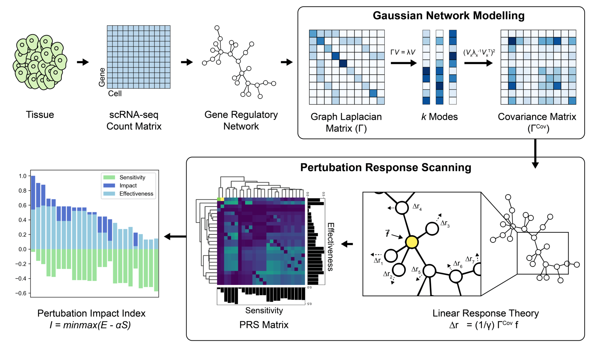

# scPII
<!-- [](https://pepy.tech/project/scPII) -->
[](https://img.shields.io/python/required-version-toml)
[](https://github.com/Xenon8778/scPII/LICENSE)


A Python package for perturbation response scanning on gene regulatory networks.


## Introduction
*Single-cell pertubation impact index (scPII)*, computes an Impact metric to quantify global effects of gene pertubations using perturbation response scanning (PRS) on gene regulatory networks.

<br>

<br> 

## Installation
You can install this package directly from GitHub using pip:
```shell
pip install git+https://github.com/xenon8778/scPII.git
```
or install it manually from source:
```shell
git clone https://github.com/xenon8778/scPII.git
cd scPII
pip install .
```
## Usage
Check out the example notebook - [Here!](docs/notebooks/small_simulated_example.ipynb)
Please install Seaborn to generate figures used in example.
```python
pip install seaborn
```

Assume 'G' is a graph and 'A' is its adjacency matrix stored as pandas DataFrame representing your GRN. Here's a quick example of how to use the main function:

```python
import pandas as pd
import networkx as nx
from scPII.core import scPRS

G = nx.powerlaw_cluster_graph(25, 1, 0.6, seed=0)
inputnet = pd.DataFrame(nx.adjacency_matrix(G).todense())

# Run perturbation response scanning (PRS)
PRSout = scPRS(inputnet)

# Summary statistics for each gene in GRN is stored in Summary layer.
print(PRSout['Summary'].head())
```

<!-- ## Contributing
We welcome contributions! Please feel free to open an issue or submit a pull request. -->

## Benchmarking Results 
Benchmarking results against various GRN construction algorithms, explained variance cutoffs and virtual KO tools are available at [10.5281/zenodo.17713781](10.5281/zenodo.17713781).

